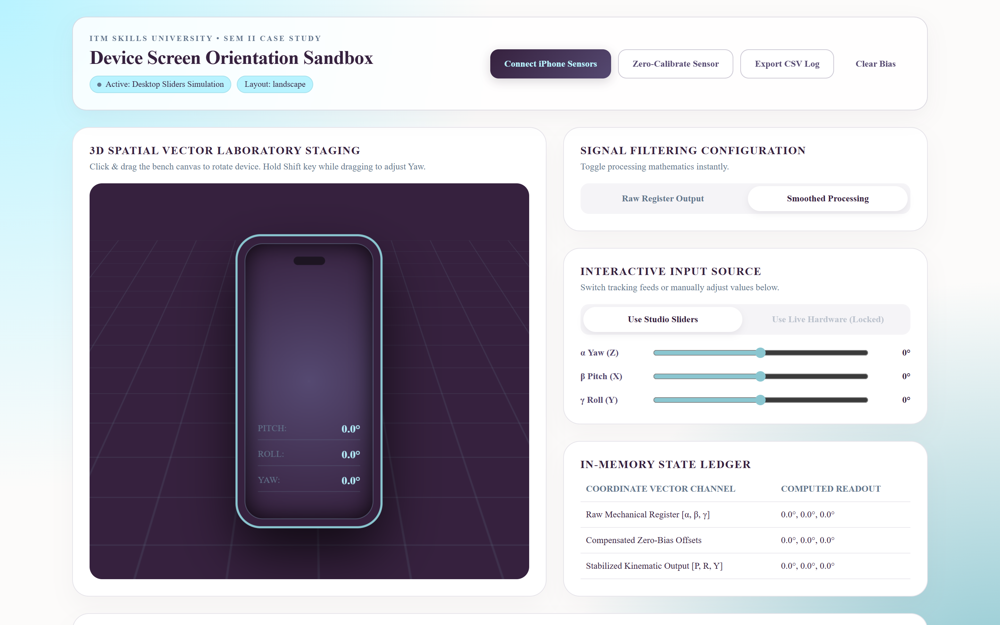
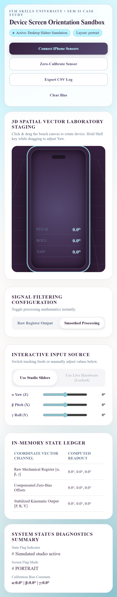

# 📱 Device Screen Orientation & Motion Calibration Sandbox

A frontend-only ReactJS web app that turns a phone's motion sensors into a live 3D telemetry lab — intercepting the browser's Device Orientation / Motion API, calibrating and smoothing the raw angular stream, and mirroring your physical device as a 3D chassis in real time. Built with React 19 + Vite, zero backend, zero network calls.

🔗 **Live Demo:** https://stutisaxena44.github.io/motion-calibration-sandbox/

> Open the live link in **Safari on iPhone** for the full hardware experience. Tap **Connect iPhone Sensors → Allow** (iOS needs HTTPS + a tap to grant motion access — GitHub Pages serves HTTPS, so it works).

---

## 📸 Screenshots of the UI

### 1. Desktop Telemetry Lab

*(Full lab layout: 3D vector staging on the left, signal/filter and input controls plus the in-memory state ledger on the right.)*

### 2. Mobile / iPhone View

*(Responsive single-column layout used on a phone — the same pipeline driven by live IMU hardware once sensors are authorized.)*

---

## ✨ Key Features

- **Hardware Telemetry Interceptor:** Hooks `deviceorientation` + `devicemotion` events and feeds a `requestAnimationFrame` loop for ~60 fps visual sync.
- **3D Virtual Chassis:** A CSS 3D transform model (`rotateX/Y/Z`) that renders live pitch / roll / yaw on the device face.
- **Zero-Bias Calibration:** Samples the IMU over a frame window, computes the mean offset, and stores it as a negative bias constant to cancel sensor drift.
- **Signal Filtering Toggle:** Switch instantly between raw register output and a smoothed low-pass feed.
- **Desktop Simulation Mode:** α / β / γ sliders plus click-drag on the 3D bench (hold **Shift** to adjust yaw) when no hardware sensors exist.
- **Orientation-Aware Mapping:** Detects portrait/landscape and adjusts the visual axis mapping accordingly.
- **In-Memory State Ledger + CSV Export:** Live table of raw, calibrated, and stabilized vectors, exportable as a flat CSV motion log.

---

## 🚀 Tech Stack

- **Framework:** React 19 (functional components, Context API, `useReducer`)
- **Build Tool:** Vite 7 (ES modules, fast HMR dev server)
- **State & Buffers:** Reducer-driven settings store + mutable `useRef` buffers for high-frequency sensor data (no database — `localStorage` persistence)
- **Styling:** CSS Modules (`*.module.css`) with a Times New Roman lab-instrument theme
- **Hosting / CI:** GitHub Pages, deployed automatically via GitHub Actions

---

## 📦 Getting Started

Requirements: **Node.js 18+** and npm.

1. **Clone the repository**
   ```bash
   git clone https://github.com/stutisaxena44/motion-calibration-sandbox.git
   cd motion-calibration-sandbox
   ```
2. **Install dependencies**
   ```bash
   npm install
   ```
3. **Start the dev server**
   ```bash
   npm run dev
   ```
   Open the printed URL (default `http://localhost:5173`). On desktop, use the sliders or drag the 3D bench — sensor hardware is not available over plain `http://`.
4. **Build for production** *(optional)*
   ```bash
   npm run build     # outputs to dist/
   npm run preview   # serves the built bundle locally
   ```

### 📲 Testing real motion on a phone
Phone motion sensors require **HTTPS**. Easiest path is the live GitHub Pages URL above. To test your own changes from a phone, deploy your branch or expose the dev server through an HTTPS tunnel (e.g. `ngrok http 5173`).

---


## 👨‍💻 Author

- **Course:** B.Tech CSE 2025-29 — React JS, Semester II Case Study
- **Institution:** ITM Skills University
- **Project:** Device Screen Orientation & Motion Calibration Sandbox (#190)
